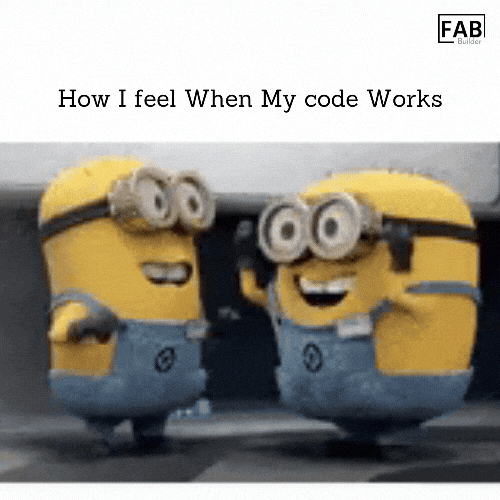
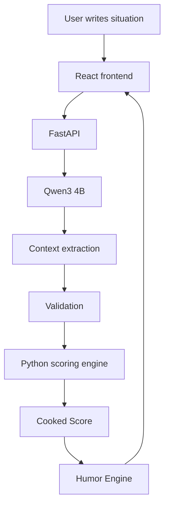
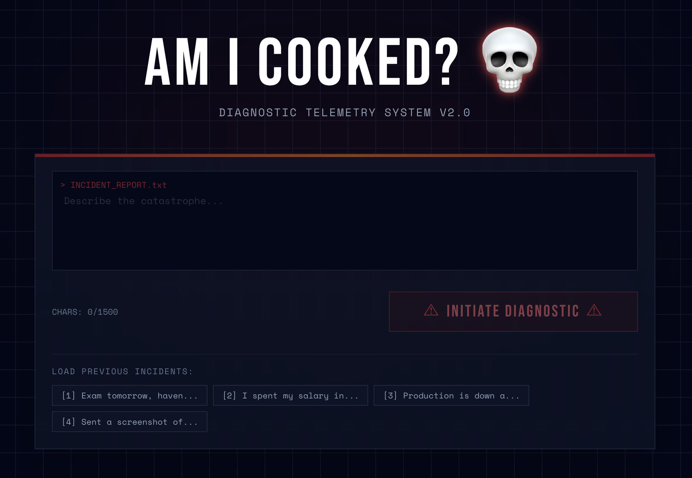
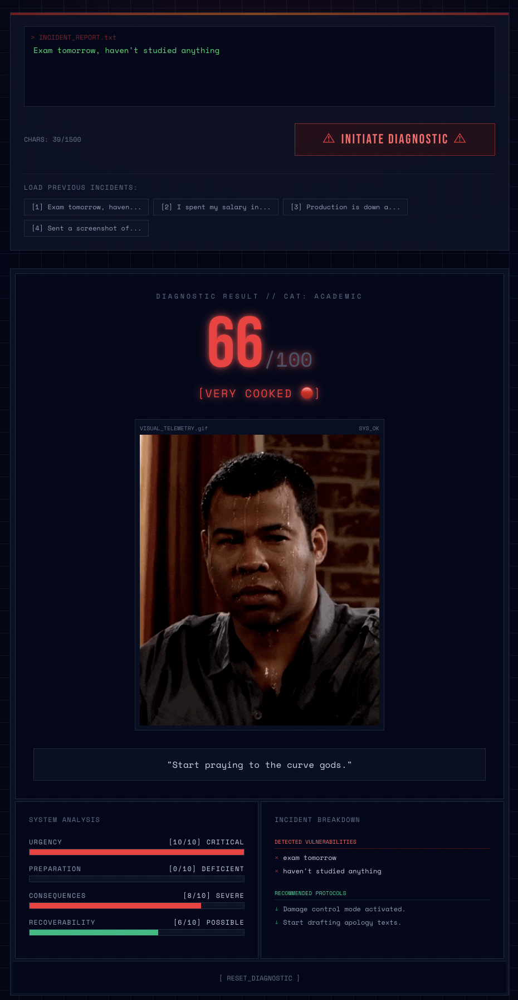
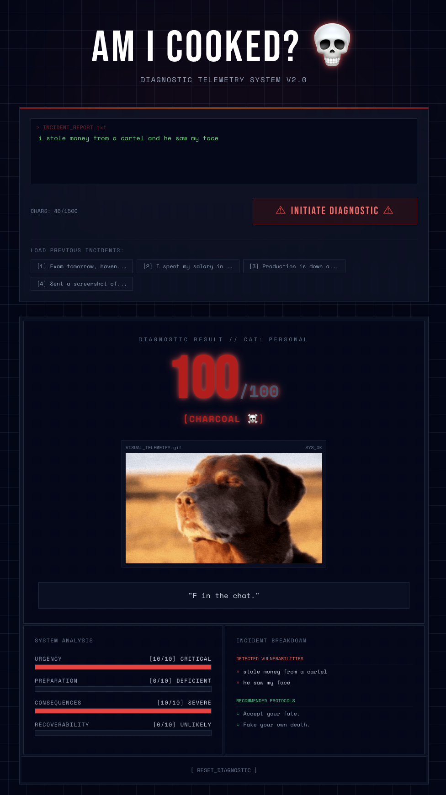

# Am I Cooked? 💀



Everyone has had that moment where they realize they have made a terrible decision.

Exam tomorrow?
Haven't studied?
Spent six hours playing games?

Yeah. You're probably cooked.

"Am I Cooked?" is a small local NLP/LLM project that tries to put a number on exactly how screwed you are. You describe your situation, and the AI extracts the facts, grades your lack of preparation, and maps it to a final "Cooked Score" between 0 and 100. 

## Why I Built This
I started with a dumb question: *can Python tell you how cooked you are?*

The joke quickly became an excuse to experiment with text embeddings, natural language processing, local LLMs running on Apple Silicon, and deterministic scoring. I wanted to see if I could make an AI that actually understands the nuances of human procrastination and failure, without just spitting back a generic ChatGPT response.

## The First Attempt (And Why It Wasn't Enough)
I originally thought this would be easy. Turn text into embeddings, throw Logistic Regression at it, and let the computer decide how screwed you are. 

The original pipeline looked like this:
```text
User text
   ↓
MiniLM embeddings
   ↓
Logistic Regression
   ↓
Cooked Level
```
This was fast, simple, and lightweight. But unfortunately, humans refuse to communicate in clean training examples. 

The problem wasn't that Logistic Regression is bad. The problem was that I was asking a relatively small text-classification system to do a job that required deep contextual interpretation. It couldn't tell the difference between *"I have an exam tomorrow and I've studied absolutely nothing"* (Very Cooked) and *"I have an exam tomorrow but I've studied 90% of the material"* (Not Cooked). Both sentences have the same important words, but entirely different meanings. Sarcasm broke it completely.

.gif)

## The Breakthrough: Qwen3 4B
Instead of asking a classifier, "Which cooked class does this sentence belong to?", I decided to ask a local language model, "What is actually happening in this situation?"

This is where the **Qwen3-4B-Instruct** model came in. 

I didn't want a massive cloud model like GPT-4 because the task is incredibly narrow, and I wanted this to run completely locally, for free, directly on Apple Silicon. Qwen3 4B is the perfect size: it's small enough to run fast, but smart enough to parse sarcasm and extract structured JSON context.

The new architecture splits the brain from the math:


The LLM **only** understands the language and extracts the facts (Urgency, Preparation, Consequences, Recoverability). It does NOT calculate the score itself. Python handles the deterministic math, ensuring consistent grading, and the humor engine serves up the jokes.

.gif)

*(Note: The old Logistic Regression baseline remains in the repository at `/predict/baseline` because it shows how the project evolved!)*

## Tech Stack
**Frontend:**
- React (Vite)
- Tailwind CSS
- Framer Motion

**Backend:**
- Python & FastAPI
- Pydantic

**ML/NLP:**
- MLX / MLX-LM (for local Qwen3 inference on Mac)
- Sentence Transformers (baseline)
- Scikit-learn & Logistic Regression (baseline)

## The Clinical Catastrophe Dashboard 💀 (Gallery)
Here is what it looks like when the telemetry system judges you:

**The Dashboard:**


**When things are mostly fine (Not Cooked):**


**When you are starting to sweat (Cooked):**


**When you are entirely beyond saving (Charcoal):**
*(Note: At this level, the screen physically shakes)*


## Local Model Setup
Because the Qwen3 4B model is ~7.5GB, the heavy model weights are intentionally excluded from Git. The directory `models/qwen3-4b/` exists, but you must download the model yourself before running the app. If you delete the project directory, you will delete your local copy of the model.

**To download the model:**
```bash
python scripts/download_model.py
```

## Setup Instructions

Want to run this yourself? Here is the exact step-by-step guide from a fresh clone. You will need Python and Node.js installed.

**1. Clone the repository**
```bash
git clone https://github.com/anirban222777das/am-i-cooked.git
cd am-i-cooked
```

**2. Setup the Python Backend Environment**
We recommend using a virtual environment (like conda or venv).
```bash
# Using conda
conda create -n cooked-env python=3.10
conda activate cooked-env

# Install backend dependencies
pip install -r requirements.txt
```

**3. Download the Local Qwen3 Model**
The 7.5GB model weights are not in this repo. You must download them to your machine. The script will automatically place them in the correct `models/qwen3-4b/` folder.
```bash
python scripts/download_model.py
```

**4. Start the FastAPI Backend**
```bash
# Make sure you are in the root directory
cd backend
uvicorn main:app --reload --port 8000
```
*The backend is now running at http://localhost:8000*

**5. Start the React Frontend**
Open a **new terminal window**, navigate to the project folder, and run:
```bash
cd frontend
npm install
npm run dev
```
*The frontend is now running at http://localhost:5173*

## API Endpoints
### `POST /predict`
The main contextual engine. Pass a JSON payload with a `text` field (min 5 characters).
**Example Input:**
```json
{"text": "Exam tomorrow, haven't studied, and spent six hours playing Hitman."}
```
**Example Output:**
```json
{
  "needs_more_context": false,
  "cooked_score": 77,
  "cooked_level": "VERY COOKED 🔴",
  "category": "academic",
  "urgency": 10,
  "preparation": 0,
  "consequences": 7,
  "recoverability": 4,
  "key_factors": [
    "exam tomorrow",
    "haven't studied",
    "wasted time playing games"
  ],
  "verdict": "Your textbook is currently serving decorative purposes.",
  "recommendations": ["Damage control mode activated.", "Start drafting apology texts."]
}
```

### `POST /predict/baseline`
The old, instantaneous Scikit-Learn baseline model for comparison.

## Limitations & Privacy
**Privacy:** The primary prediction engine runs 100% locally. Your text is processed by the local Qwen3 model on your hardware. There are no cloud APIs or API keys.

**Limitations:**
- Qwen3 4B is a small model. It sometimes gets sarcasm hilariously wrong.
- Local inference takes about 8-10 seconds on an M-series Mac. It is noticeably slower than a lightweight classifier.
- The Cooked Score is a custom, gamified metric. It is not scientifically validated. If it says you're ruined, please don't actually panic.

## Future Ideas
- Smaller quantized model for faster inference.
- Shareable result cards so you can brag about how doomed you are.
- A "Roast me harder" button.
- Compare human judgment vs model judgment.
